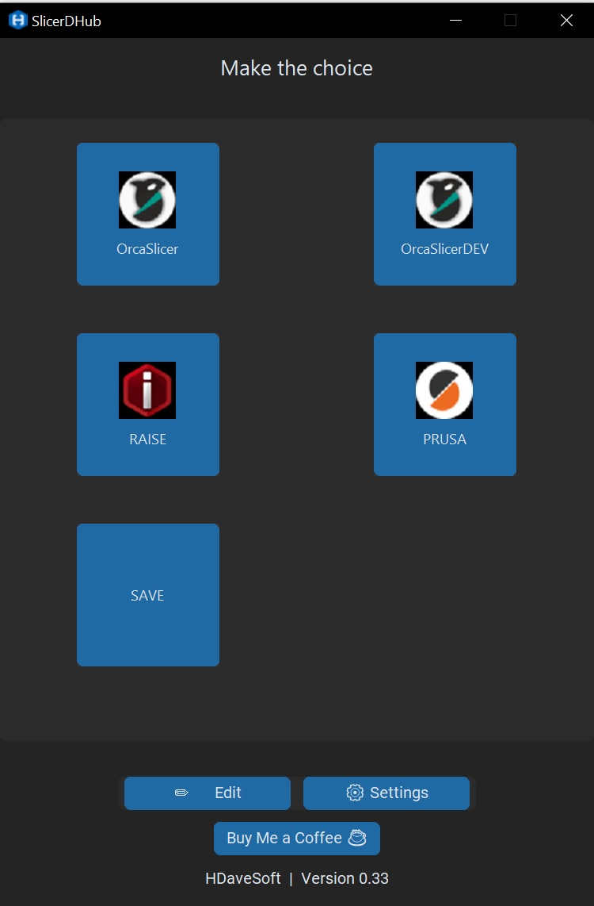

# SlicerDHub

**SlicerDHub** is an application that allows Fusion 360 users to export models and easily send them to various slicers that are not officially supported.



[Project homepage](https://github.com/DAVEfromCZE/SlicerDHub) | [🇨🇿 Česká verze](README.cz.md)

## Main Features

- Launch the slicer and pass the exported file
- Save the exported model to a chosen folder
- Simple GUI with tile-based slicer selection
- Add and remove slicers directly from the app
- Automatic slicer icon detection (from .exe file)
- Support for light, dark, or system theme
- "Edit" mode to manage slicer tiles

#### Tested slicers:

- Bambu Studio
- Orca Slicer
- IdeaMaker
- PrusaSlicer / Prusa Studio

(More will be added gradually)

## Requirements

- Windows 10/11
- Python 3.10+ (64-bit recommended)
- Required packages:
  - `customtkinter`
  - `Pillow`
  - `pywin32`
  - `pyinstaller` (for compilation)

## Installation and Launch

### 1. Clone the repository

```
git clone https://github.com/DAVEfromCZE/SlicerDHub.git
cd slicerdhub
```

### 2. Run the Python version

```
python slicerdhub.py
```

### 3. Create an executable .exe (optional)

```
build.bat
```

The `slicerdhub.exe` file will be located in the `dist/` folder.

## How it works

- If launched manually, the GUI opens where you can add slicers or save a file
- If integrated with Fusion 360's export, it receives a file path and opens a slicer with that file

## Fusion 360 Integration

To use SlicerDHub from within Fusion 360:

1. Choose **File > Save as Mesh**
2. In the dialog:
   - Under **Preparation type**, select **Print Utility**
   - Under **Output application**, select **Custom**
   - Browse and select `slicerdhub.exe` as the target
3. Click **OK** to confirm

This will launch SlicerDHub with the exported model ready to be sliced.

## Settings

- Option to auto-close the hub after launching a slicer
- Theme selection (light, dark, system)
- Data is stored in `~/.slicerdhub/config.json`

## Author

David H. (HDaveSoft)

Icon and design: AI-generated and manually adjusted for the project

If this app helped you, you can support me here: [https://coff.ee/hdavesoft](https://coff.ee/hdavesoft)

## License

This project is licensed under the **Creative Commons Attribution-NonCommercial-ShareAlike 4.0 International (CC BY-NC-SA 4.0)** license.

This means:

- You can freely use and modify the app for non-commercial purposes
- You must credit the original author (HDaveSoft) and include this license
- You may not sell the software or accept donations without crediting the author and linking: [https://coff.ee/hdavesoft](https://coff.ee/hdavesoft)
- Any changes must be shared under the same license

Details: [https://creativecommons.org/licenses/by-nc-sa/4.0/](https://creativecommons.org/licenses/by-nc-sa/4.0/)

---

## TODO

- Drag & drop support
- Ability to drag STL directly onto slicer tile
- MacOS version
